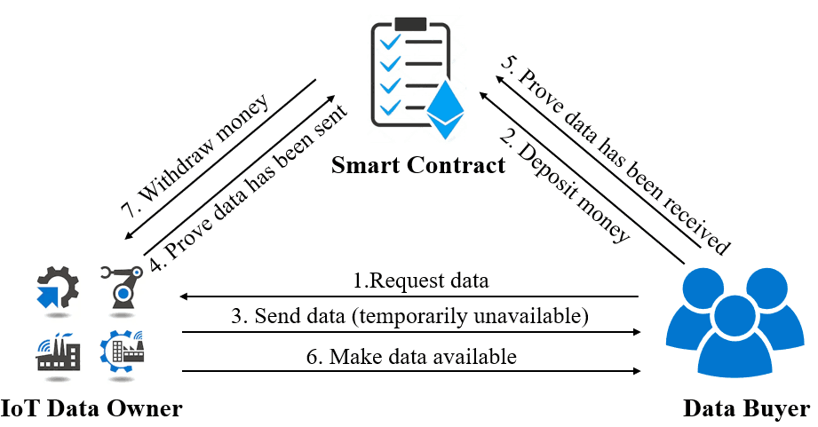

# A Blockchain Based Non-repudiation Scheme for IoT Data Trading: Simpler, Faster, and Cheaper
We propose a blockchain-based non-repudiation scheme to build trust between the data owners and data buyers for IoT data trading. The proposed scheme uses smart contract to achieve automatic payment, which does not require a third-party. To enable non-repudiation, the proposed scheme records data sending and the corresponding receipt proof on the blockchain. When disputes happen, the smart contract is triggered to achieve automatic arbitration. 

The system model is shown as the following figure and the smart contract code can be found in `non-repudiation.sol` file.

## Usage
We prototyped and evaluated the proposed scheme using the Ethereum Kovan test blockchain.
We wrote a Java program to interact with the Kovan test blockchain network and implements the off-chain part.
In order to deploy and call the smart contract, we use the web3j package, which is a lightweight and type-safe Java library for working with smart contracts on the Ethereum network.

### Create a wallet
You can run the `CreateWallet.java` to create your wallet.
You need to create three wallet for test, including arbitrator、data owner and data buyer.
Moreover, you need to obtain the test Ether token of the Kovan chain to be able to pay for the gas by deploying the contract. 

### Deploy contract
In order to use our java code to deploy and call the smart contract, you need to modify the configuration file `properties` first, and then run the `ContractDeploy.java` to deploy the smart contract.

After deployment, you can get the contract address.

## Call the contract
You can choose a file and run the `ContractCall.java` to run test the contract method. 
In this code, `this.messageBitLength` means the size of S2, so you can change it from a small one to a large one to test the contract.

## On-chain and Off-chain cost
`ContractGas.java` can test the gas cost of each function of the contract.

`OffchainComputationCost.java` can test the off-chain cost.

